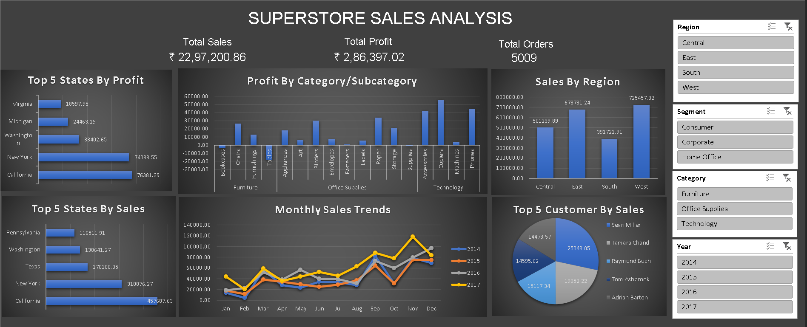

# 🛒 Superstore Sales Dashboard (Excel)

An interactive Excel dashboard to analyze sales, profit, and order trends across various regions, categories, and customer segments for a global superstore.

---

## 📌 Project Overview

This project was built to simulate a real-world business analytics use case using Excel. It helps business managers understand:

- Which regions and states are the most profitable
- Which product categories underperform
- Monthly sales trends across years
- Customer and product-level sales performance

---

## 🎯 Objectives

- Design a dynamic dashboard to support decision-making
- Use Excel tools to build business intelligence (BI) style reports
- Practice real-life KPIs and analytics for retail domain

---

## 🛠 Tools & Features Used

- Microsoft Excel
- PivotTables & PivotCharts
- Slicers for dynamic filtering
- KPI summary cards
- Line, Bar, Column, and Pie charts
- Custom dashboard formatting (dark theme)

---

## 📊 Dashboard Features

| Component | Description |
|----------|-------------|
| **KPI Summary Cards** | Total Sales, Profit, and Orders |
| **Monthly Sales Trends** | Year-wise line chart for trend comparison |
| **Sales by Region** | Bar chart to compare sales across regions |
| **Profit by Category/Sub-Category** | Detailed breakdown using column chart |
| **Top 5 States by Sales & Profit** | Ranked horizontal bar charts |
| **Top Customers** | Pie chart showing sales contribution |
| **Slicers** | Filter dashboard by Region, Segment, Category, Year |

---

## 📈 Insights

- **California** and **New York** are top contributors in both sales and profit
- **Technology** is the most profitable category
- Monthly sales peak in **November and December**, indicating seasonal demand
- **East and West regions** outperform others consistently

---

## 📁 Dataset

- Source: [Superstore Dataset on Kaggle](https://www.kaggle.com/datasets/vivek468/superstore-dataset-final)
- Format: CSV → Excel (`.xlsx`)
- Fields: Order ID, Product, Sales, Profit, Category, Sub-Category, Region, State, Segment, Order Date, etc.

---

## 📘 Learning Outcome

- Reinforced skills in PivotTable and PivotChart usage
- Understood business-focused layout and storytelling in Excel
- Learned to combine analytics with UI design to produce professional dashboards

---

## 📌 Author

**Sourabh Sonker**  
Data Enthusiast | Excel & BI Learner  

---

